# Angular Project Structure

- `src/`: Contains the source code of the Angular application.
  - `app/`: Contains components, services, modules, and other application-specific files.
  - `assets/`: Contains static files such as images, CSS files, etc.
  - `environments/`: Contains configuration files for different environments (development, production, etc.).
  - `index.html`: Entry point of the application where the Angular application is loaded in the browser.
- `angular.json`: Global configuration file for the Angular application. It specifies build, compile, and deployment settings for the application.
- `tsconfig.json`: Contains TypeScript configuration for the application.
- `Service files`: Angular services are typically defined in separate files and provide shared functionality and data processing operations.

# Models

## Customer:
The Customer interface defines the structure of an object representing a customer, including the properties id, name, and email.

## Bank Account:
The BankAccount interface defines the structure of an object representing a bank account, including the properties id, type, date_createdAt, balance, status, overDraft, and interestRate.

## Account Operation:
The AccountDetails interface defines the structure of an object representing the details of a bank account, including the properties accountId, balance, currentPage, totalPages, pageSize, and accountOperationDTOS, where accountOperationDTOS is an array of AccountOperation objects.

# Services

## accounts-service.ts:

The AccountsService service is injectable and uses the HttpClient module to make HTTP requests. It contains methods to retrieve account details, perform debit, credit, and money transfer operations, as well as to fetch accounts of a specific customer. The request URLs are based on the backendHost environment defined in environment.ts. Here are some examples of service methods for bank accounts:

- The getAccount method retrieves account details using its identifier, page number, and page size by making a GET request to the backend API.

- The debit, credit, and transfer methods respectively perform debit, credit, and money transfer operations by sending necessary data (source account, destination account, amount, and description) via POST requests to the backend API.

## customer-service.ts:

The CustomerService service is injectable in Angular used to interact with customer data. It uses the HttpClient module to make HTTP requests to the backend API and provides methods such as getCustomers to retrieve the list of all customers, searchCustomers to search for customers based on a keyword, saveCustomer to save a new customer, and deleteCustomer to delete an existing customer. Here are some examples of service methods for customers:

- The getCustomers method retrieves the list of all customers by making a GET request to the backend API.

- The searchCustomers method allows searching for customers based on a given keyword.

- The saveCustomer method saves a new customer by sending the data via a POST request.

- The deleteCustomer method deletes a specified customer by making a DELETE request to the backend API.


# Installation

1. Clone the project:
  ```bash
git clone https://github.com/dohabanoui/product-management-Angular
  ```
2. Navigate to the frontend directory to install dependencies:
  ```bash
cd product-management-Angular
npm install
  ```
3. Start the frontend in the terminal:

  ```bash
ng serve
  ```
4. Lastly, start the main backend application.
Note: Ensure that XAMPP is running.
5.Open your browser and go to http://localhost:4200/.

# Result


For the login interface, the user (either admin or not) needs to enter the username and password.
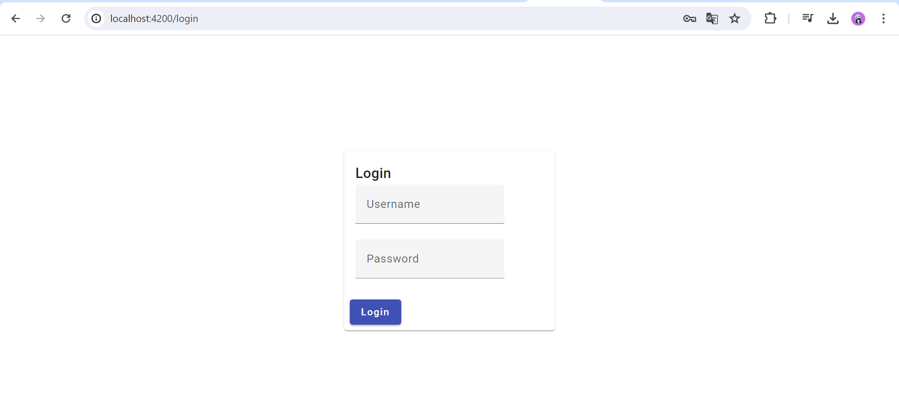

When the admin enters their information, another interface is displayed.

When the admin clicks on "Customers", they will see a list of customers with a search function. Additionally, they can modify, delete, or view the accounts of each customer. They also have the option to add another customer.
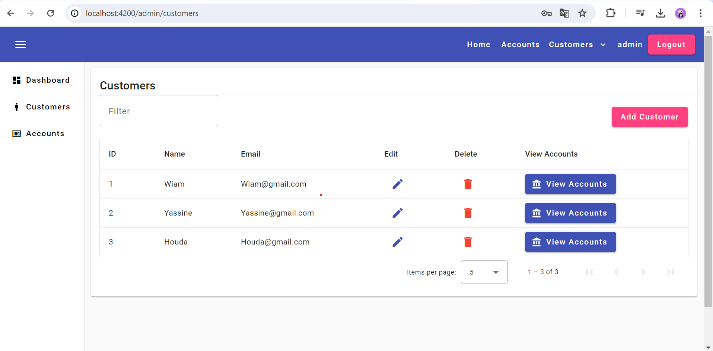
To view customer details
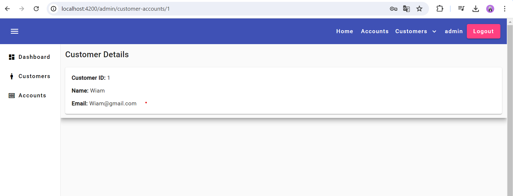
If the admin wants to add a new client, they need to enter the name and email of the client.
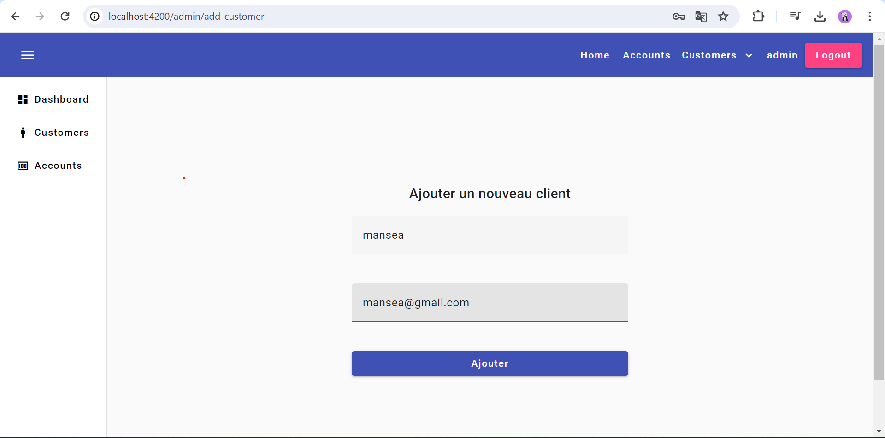
And there, the customer is added to the list of customers.
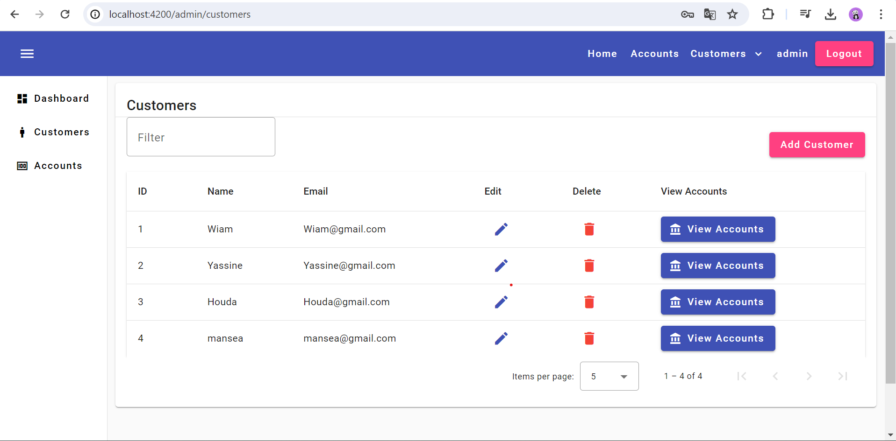
To view the accounts registered in the backend, but not working after security implementatio
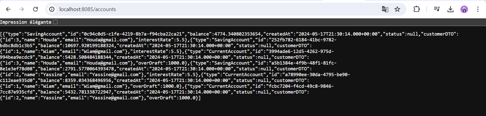
Upon taking the customer's ID and clicking on "Accounts", it will display as follows. Then, input the customer's ID and click on "Search".
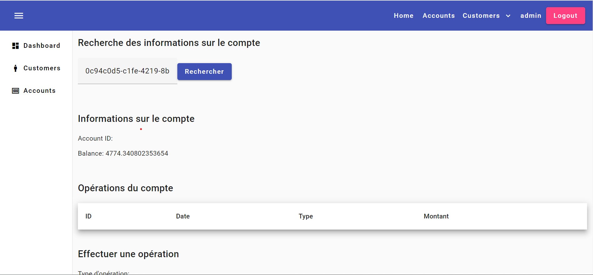
When you click on "Search", it will display the customer's balance and the operations they want to perform.
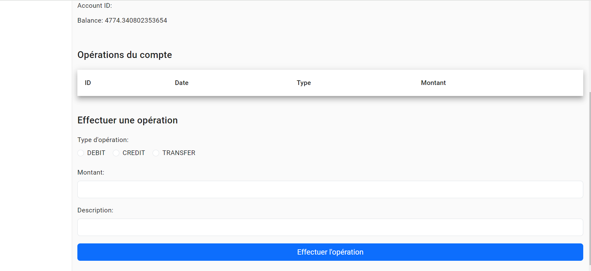
If they choose to fill in, for example, with this information
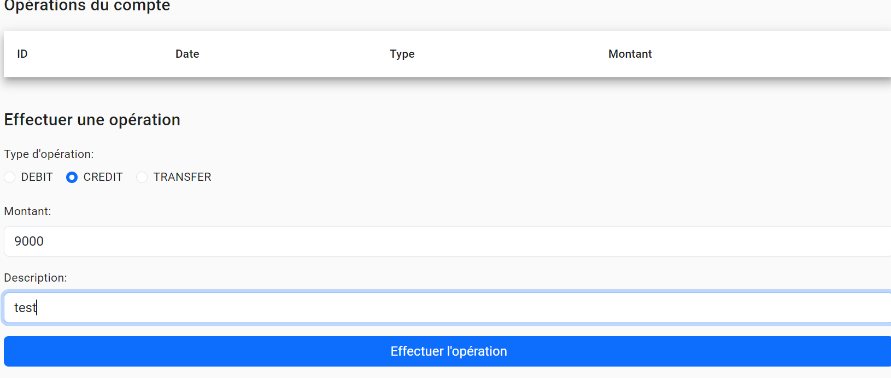
Or if they choose to transfer, another field will appear to designate the destination.
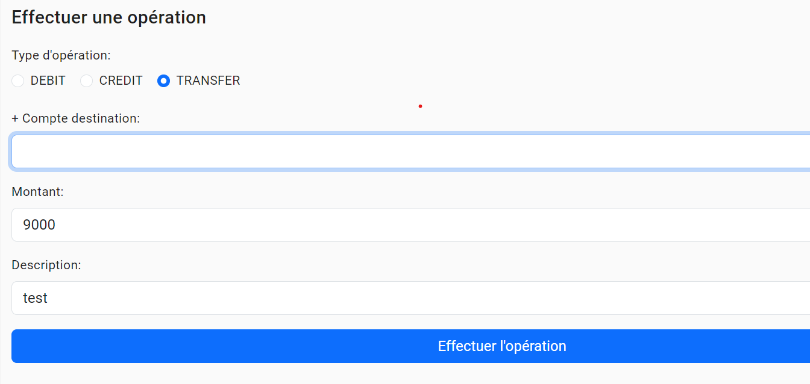
This interface is for modifying customer data.
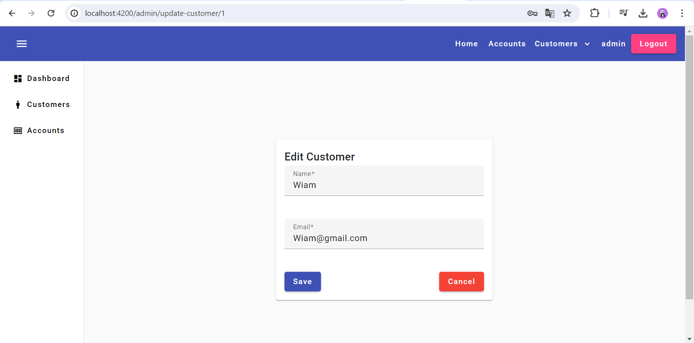


## Development server

Run `ng serve` for a dev server. Navigate to `http://localhost:4200/`. The application will automatically reload if you change any of the source files.

